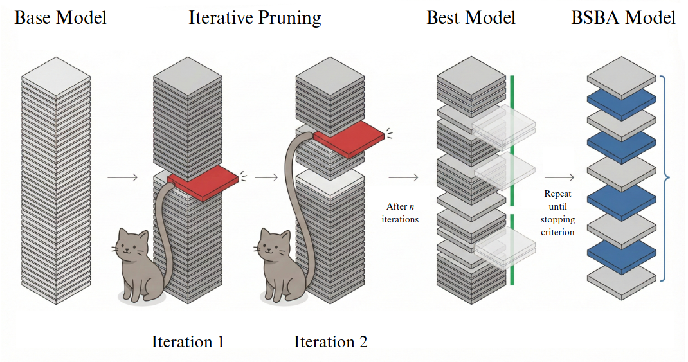

# TELL-TALE

### Code for **TELL-TALE: Task Efficient LLMs with Task Aware Layer Elimination**.

#### Accepted at **Findings of ACL 2026**.

Paper: <https://arxiv.org/pdf/2510.22767>



TALE is an inference-time layer elimination method for open-weight decoder LLMs. For a fixed task, it greedily evaluates candidate single-layer removals, keeps the removal that gives the best validation accuracy, and repeats until accuracy falls below a user-defined threshold.

## Repository Layout

```text
.
├── src/tale/search.py                   # Main TALE greedy search entrypoint
├── src/tale/modeling.py                 # Layer-eliminated decoder wrapper
├── src/tale/tasks.py                    # Task loaders and prompt builders
├── slurm_tale_search.sh                 # Slurm launcher for TALE search
├── slurm_benchmark_inference.sh         # Slurm launcher for inference benchmarking
├── datasets/                            # CSV preparation scripts
├── data/                                # Expected local CSV location
└── experiments/
    ├── inference_benchmark.py           # Baseline vs TALE inference benchmark
    ├── task_search/                     # Task-specific reproduction scripts
    ├── slurm/                           # Matching Slurm launchers
    └── mutual_information/              # MI analysis scripts and plots
```

## Installation

Python 3.10+ is recommended.

```bash
python -m venv .venv
source .venv/bin/activate
pip install --upgrade pip
pip install -r requirements.txt
export PYTHONPATH="$PWD/src:${PYTHONPATH:-}"
```

## Prepare Data

The runners expect CSV files. By default, examples below write them under `data/`.

```bash
python datasets/arc/arc.py --config ARC-Easy --split validation --output data/arc/arc_easy_validation.csv
python datasets/arc/arc.py --config ARC-Challenge --split validation --output data/arc/arc_challenge_validation.csv
python datasets/boolq/boolq.py --split validation --output data/boolq/boolq_validation.csv
python datasets/commonsense_qa/commonsense_qa.py --split validation --output data/commonsense_qa/commonsenseqa_validation.csv
python datasets/mmlu/mmlu.py --subset all --split validation --output data/mmlu/mmlu_all_validation.csv
python datasets/winogrande/winogrande.py --subset winogrande_debiased --split validation --output data/winogrande/winogrande_debiased_validation.csv
python datasets/bigbench/bigbench.py --output data/bigbench/bigbenchhard_boolean_expressions_train.csv
python datasets/gsm8k/gsm8k.py --input <GSM8K_FILTERED_CSV> --output data/gsm8k/gsm8k_test_filtered.csv
python datasets/math500/math500.py --output data/math500/MATH-500.csv
```

## Run TALE Search

```bash
python -m tale.search \
  --model <MODEL_PATH_OR_HF_ID> \
  --task arc_easy \
  --data-path data/arc/arc_easy_validation.csv \
  --output-dir outputs/tale_search/arc_easy
```

Useful options:

```bash
--epsilon 0.08                  # accuracy floor is baseline - epsilon
--num-samples 550               # defaults to all rows in the CSV
--max-new-tokens 1              # use larger values for math tasks
--max-drop-layers 8             # optional search cap
--torch-dtype bfloat16          # auto, float16, bfloat16, or float32
--trust-remote-code             # pass through to transformers
```

Outputs:

```text
outputs/tale_search/<task>/
├── summary.json
├── accepted_configs.json
├── candidate_results.csv
└── baseline_predictions.json
```

## Slurm

In the paper experiments, the search was performed using a single NVIDIA A100 80GB GPU. You may use the provided Slurm script as a template and modify it according to the configuration, resource limits, and scheduling policies of your own cluster.

```bash
MODEL_PATH=<MODEL_PATH_OR_HF_ID> \
TASK=arc_easy \
DATA_PATH=data/arc/arc_easy_validation.csv \
OUTPUT_DIR=outputs/tale_search/arc_easy \
sbatch slurm_tale_search.sh
```

Optional environment variables:

```bash
NUM_SAMPLES=550
EPSILON=0.08
MAX_DROP_LAYERS=8
CONTAINER_IMAGE=<APPTAINER_IMAGE_PATH>
BIND_PATHS=<BIND_PATHS>
```

If `CONTAINER_IMAGE` is not set, the script uses the active Python environment on the compute node.

Slurm launcher outputs are written under `OUTPUT_DIR/job_<slurm_job_id>/` and include a `command.sh` snapshot.

## Latency and Throughput

Run baseline vs a TALE-pruned layer set:

```bash
python experiments/inference_benchmark.py \
  --model <MODEL_PATH_OR_HF_ID> \
  --model-name <MODEL_DISPLAY_NAME> \
  --task arc_easy \
  --data-path data/arc/arc_easy_validation.csv \
  --drop-layers-0idx 18,19,20,28,31 \
  --output-dir outputs/inference_benchmark
```

The benchmark writes `results.csv`, `comparison.csv`, and `run.log` under `OUTPUT_DIR/job_<slurm_job_id>/run_<timestamp>/` when launched with Slurm.

Slurm:

```bash
MODEL_PATH=<MODEL_PATH_OR_HF_ID> \
MODEL_NAME=<MODEL_DISPLAY_NAME> \
TASK=arc_easy \
DATA_PATH=data/arc/arc_easy_validation.csv \
DROP_LAYERS_0IDX=18,19,20,28,31 \
sbatch slurm_benchmark_inference.sh
```

## Task-Specific Reproduction Scripts

Task-specific reproduction scripts are kept under `experiments/task_search/` with matching Slurm files under `experiments/slurm/`. They use:

```bash
TALE_MODEL_PATH=<MODEL_PATH_OR_HF_ID>
TALE_DATA_PATH=<TASK_CSV_PATH>
```

Prefer `python -m tale.search` for new runs; it provides one consistent interface and structured outputs.

## Citation

```bibtex
@misc{naim2026tale,
  title = {TELL-TALE: Task Efficient LLMs with Task Aware Layer Elimination},
  author = {Naim, Omar and Sharma, Krish and Barman, Niyar R. and Asher, Nicholas},
  year={2026},
  eprint={2510.22767},
  archivePrefix={arXiv},
  primaryClass={cs.LG},
  url={https://arxiv.org/abs/2510.22767}, 
}
```
